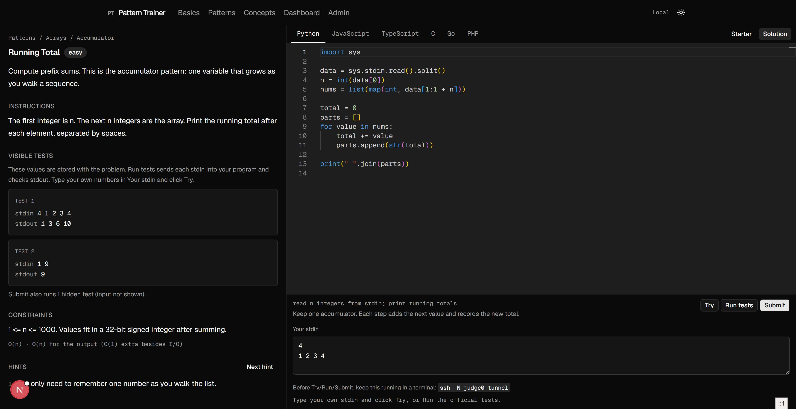

# Pattern Trainer

Learn **programming patterns**, not a language in isolation.

A problem is the same idea in every language. You write it in Monaco, run it against stdin/stdout tests, then solve it again in Python, JavaScript, TypeScript, C, Go, or PHP.

Two tracks:

- **Basics** (`/basics`) — variables, control structures, loops, arrays, sets
- **Patterns** (`/problems`) — named patterns, starting with accumulator / Running Total



Canonical spec: [docs/PRD.md](docs/PRD.md) · Architecture: [docs/ARCHITECTURE.md](docs/ARCHITECTURE.md) · Plan: [docs/IMPLEMENTATION_PLAN.md](docs/IMPLEMENTATION_PLAN.md)

## Stack

Next.js 16 App Router, React 19, TypeScript, Tailwind v4, shadcn/ui, Monaco, Zod, Vitest. Supabase is planned for auth and progress.

Code never runs in the browser or on Vercel. The app talks to **[Judge0](https://ce.judge0.com/)**: this project uses a **self-hosted Judge0 CE** instance. To run Try / Run tests / Submit yourself, either [self-host Judge0 CE](https://github.com/judge0/judge0/blob/master/CHANGELOG.md) on your own VPS or subscribe to a [hosted Judge0 plan](https://ce.judge0.com/) and point the app at that API.

## Run locally

```bash
cp .env.example .env.local
npm install
npm run dev
```

Open [http://localhost:3000](http://localhost:3000). Auth is off by default (`AUTH_DISABLED=true`).

### Run / Submit / Try

This app connects to a **self-hosted Judge0** sandbox. The browser only calls `/api/execute`; Next.js forwards submissions to Judge0.

To run code yourself, pick one:

1. **Self-host Judge0 CE** on a Linux VPS (this repo’s setup: Ubuntu 22.04, Docker, API on port 2358). Official deploy notes are in the [Judge0 v1.13.1 release](https://github.com/judge0/judge0/releases/tag/v1.13.1).
2. **Subscribe to hosted Judge0** ([CE docs and plans](https://ce.judge0.com/)) and use their base URL and API key instead.

Then set `.env.local`:

```bash
JUDGE0_BASE_URL=http://127.0.0.1:2358   # or your hosted Judge0 URL
JUDGE0_API_KEY=                         # self-hosted X-Auth-Token, or subscription key
```

If self-hosted Judge0 is bound to localhost on the VPS, keep a tunnel open while you train:

```bash
ssh -N judge0-tunnel
```

- **Try** — your stdin, no grading
- **Run tests** — visible official cases
- **Submit** — includes hidden tests (input not shown)

Do not commit `.env.local`. You can browse the curriculum without Judge0; execution buttons will fail until it is connected.

## Scripts

```bash
npm run lint
npm run typecheck
npm test
```

## Later

To turn auth on: set `AUTH_DISABLED=false`, fill the Supabase variables, apply `supabase/migrations`, then promote an admin:

```sql
update public.profiles set role = 'admin' where id = '<user-uuid>';
```
